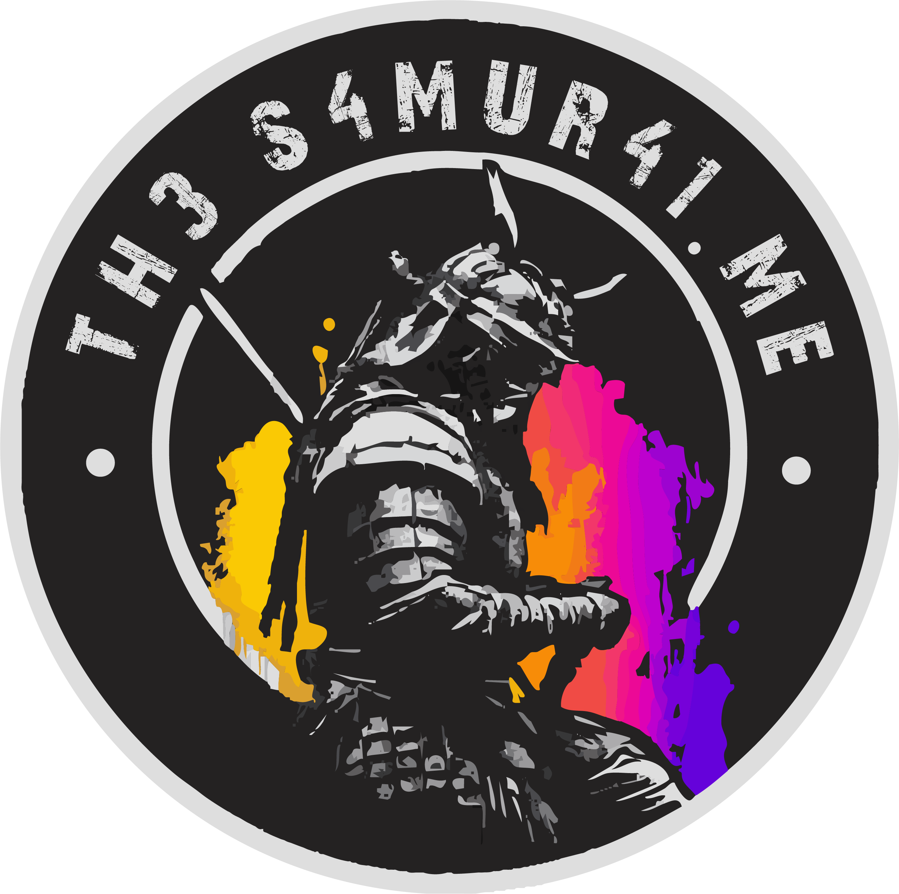

  

# Michaël Vanderheyden aka. Th3S4mur41

I am a **Lead UX Engineer and Accessibility Specialist** based in Belgium. My work is driven by the belief that the web should be an inclusive space where seamless, intuitive interactions are available to everyone, regardless of ability or context.

## The Digital Dojo
Beyond my professional role, I maintain a personal laboratory and blog at **[th3s4mur41.me](https://th3s4mur41.me/)**. This is my primary training ground where I experiment with modern HTML and CSS, exploring the boundaries of progressive enhancement and inclusive design.

I regularly publish my findings on **UX engineering**, **A11y test automation**, and the evolving landscape of frontend development. If you are interested in clean, future-proof code and technical discipline, you can find my latest notes in the **[Dojo](https://th3s4mur41.me/blog/)**

### Latest posts
<!-- BLOG-POST-LIST:START -->
<!-- BLOG-POST-LIST:END -->

## Connect & Collaborate
I’m always open to discussing web standards, accessibility, or the martial arts discipline applied to engineering.

* **Official Home:** [th3s4mur41.me](https://th3s4mur41.me/)
* **Social:** [Bluesky](https://bsky.app/profile/th3s4mur41.me) • [LinkedIn](https://linkedin.com/in/michaelvanderheyden)
* **Feed:** [RSS Subscription](https://th3s4mur41.me/rss.xml)

> The web is my dojo; every line of code is a chance to sharpen the craft.
